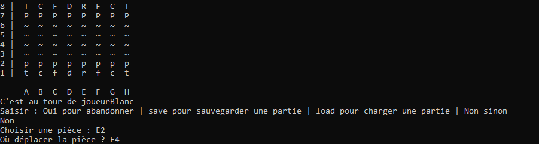

# JavaEchec 

Ce projet à été réalisé dans le cadre du projet tuteuré du S2 de DUT INFO à L'université sorbonne paris nord.
Il s'agit d'un jeu d'échecs basique avec vérification MAT/PAT

Pour exécuter le programme, un jar est mis à votre disposition :

> java -jar ./bin/artifacts/JavaEchec_jar/JavaEchec.jar

# Présentation du jeu

Le jeu se présente dans une console où le joueur peut décider d'effectuer des actions comme :
* Abandonner
* Sauvegarder/Charger une partie
* Choisir une pièce à déplacer
* Choisir un déplacement

